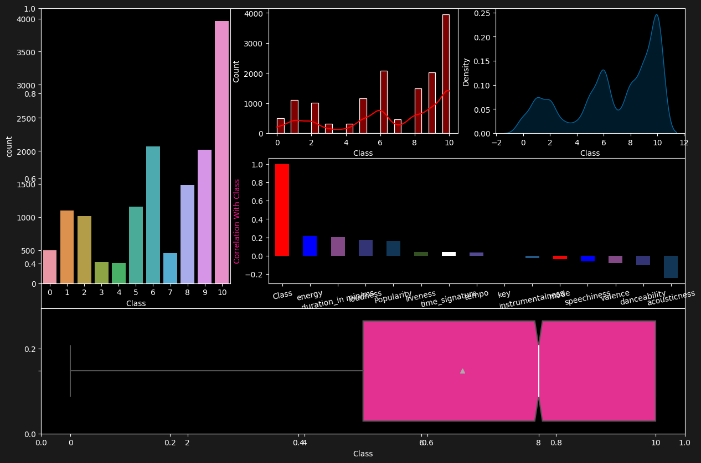
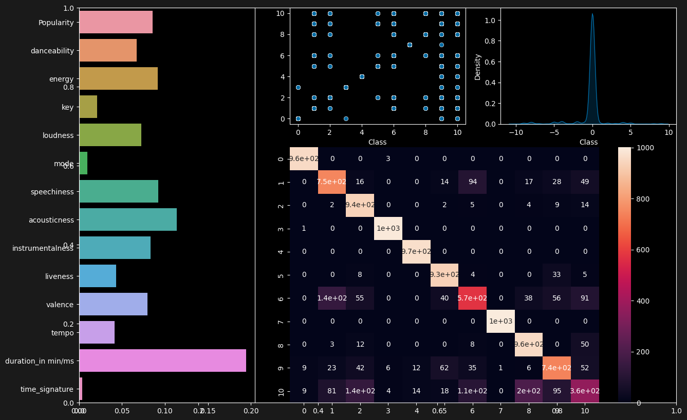
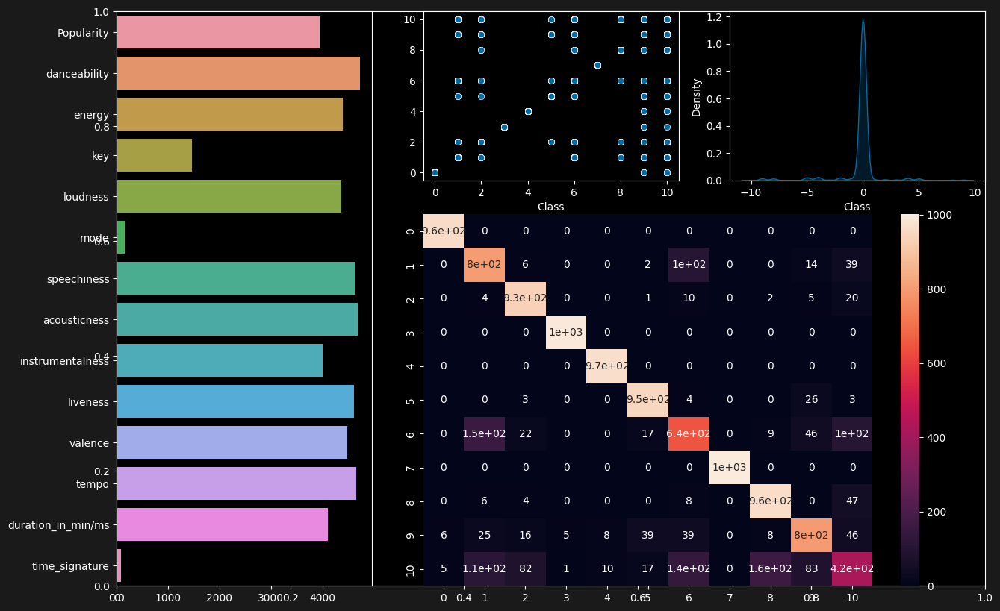
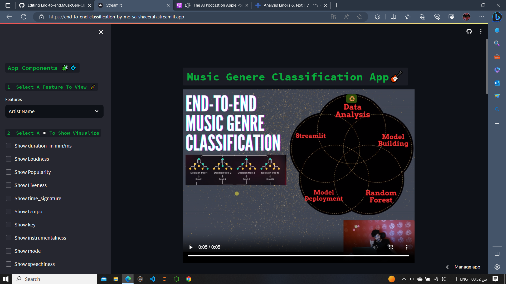
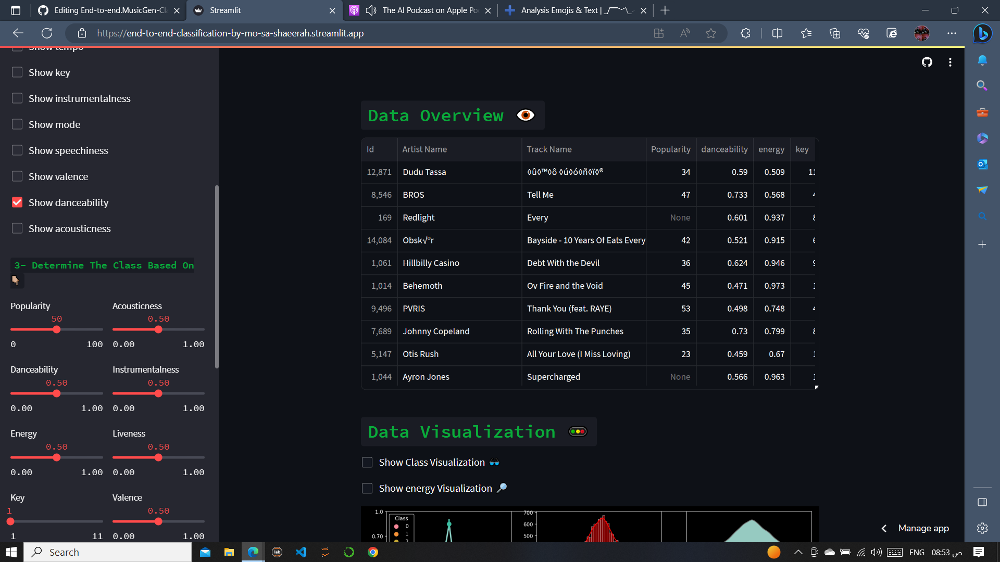
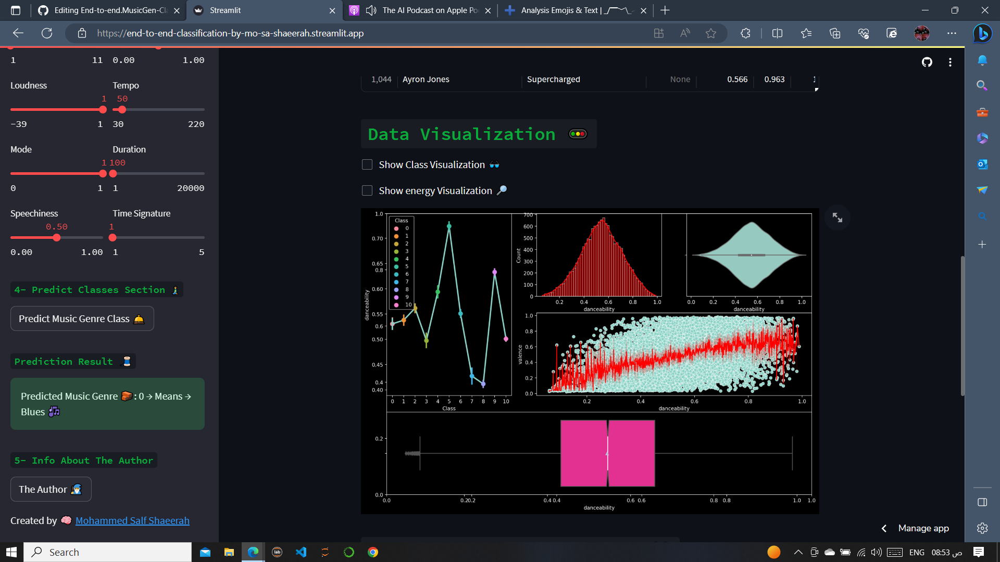
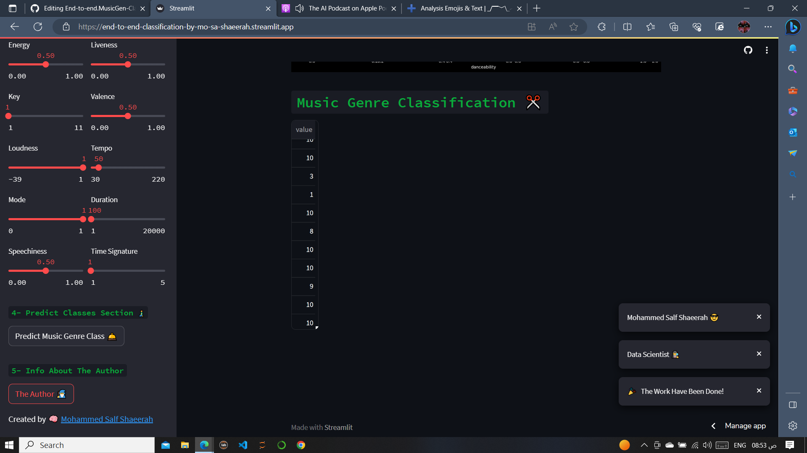

# `End-to-end.MusicGen-Classification 🎭`

 

# `Project Contents 📦`
1. [Music Data Analysis](#data)
2. [Models That Used](#models)
3. [Things weren't adding any value](#things)
4. [Why Is The Acuuracy around 60%?](#why)
5. [Deployment Step](#streamlit)
6. [Lastly](#lastly)

# 🧐 1. Music Data Analysis 

A Plots About The Class[The Target] To Get Insights

 

# ⚖️ 2. Models That Used 
2.1- Random Forest 👉🏻 The best algorithm

`Here is an evaluation about accuracy, performance & feature importance of Random Forest`

 
 
2.2- LGBM

`Here is an evaluation about accuracy, performance & feature importance of LightGBM`

 

# 🔰 3. Things weren't adding any value 

I have tried lots of models, tools, and thinking outside the box to enhance the performance and ⬆ the accuracy. 

Some examples include:
- Deeplearning Models like DatRetClassifier
- Using Optuna to optimize the parameters
- Implementing normalization methods
- Employing an oversampling strategy

# 🤔 4. Why Is The Acuuracy around 60%? 

The accuracy is still around 50-60% due to the following reasons:

- I have dropped the categorical attribute instead of using label encoder
- There is no correlation between data points and the class
- Imbalanced classes, and so on

# 🧑‍🚀 5. Deployment Step 

`A snippet pictures about the app 👇🏻`

 
 
 
 

# 🌜 6. Lastly 

`Give a try to my app` 👉🏻 

`Watch the app life on my youtube channel` 👇🏻

https://img.youtube.com/vi/LU80ixSVQ-c/0.jpg)](https://youtu.be/LU80ixSVQ-c?si=koPdALvQjMxaznpg
